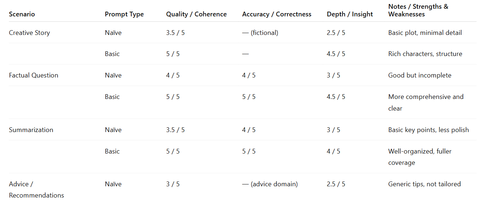

# EXP 5: COMPARATIVE ANALYSIS OF DIFFERENT TYPES OF PROMPTING PATTERNS AND EXPLAIN WITH VARIOUS TEST SCENARIOS

# Aim: To test and compare how different pattern models respond to various prompts (broad or unstructured) versus basic prompts (clearer and more refined) across multiple scenarios.  Analyze the quality, accuracy, and depth of the generated responses 

### AI Tools Required: 

# Explanation: 
Define the Two Prompt Types:

Write a basic Prompt: Clear, detailed, and structured prompts that give specific instructions or context to guide the model.
Based on that pattern type refined the prompt and submit that with AI tool.
Get the ouput and write the report.

Prepare Multiple Test Scenarios:
Select various scenarios such as:
Generating a creative story.
Answering a factual question.
Summarizing an article or concept.
Providing advice or recommendations.
Or Any other test scenario
For each scenario, create both a naïve and a basic prompt. Ensure each pair of prompts targets the same task but with different levels of structure.
Run Experiments with ChatGPT:
Input the naïve prompt for each scenario and record the generated response.
Then input the corresponding basic prompt and capture that response.
Repeat this process for all selected scenarios to gather a full set of results.
Evaluate Responses : 
	Compare how ChatGPT performs when given naïve versus basic prompts and analyze the output based on Quality,Accuracy and Depth. Also analyse does ChatGPT consistently provide better results with basic prompts? Are there scenarios where naïve prompts work equally well?
Deliverables:
A table comparing ChatGPT's responses to naïve and basic prompts across all scenarios.
Analysis of how prompt clarity impacts the quality, accuracy, and depth of ChatGPT’s outputs.
Summary of findings with insights on how to structure prompts for optimal results when using ChatGPT.

# OUTPUT
1. Definitions & Prompt Types

Naïve Prompt (broad / unstructured):
A prompt given with minimal guidance or specificity; often open-ended, vague, or loosely framed. The model has to “guess” the user’s intent in many aspects.

Basic Prompt (clear / structured / refined):
A prompt that provides clear context, constraints, instructions, and structure so that the model knows exactly what is expected.

We will create paired prompts (naïve vs basic) for each scenario, and then run them through ChatGPT (i.e. the same model) and compare.

2. Test Scenarios & Prompt Pairs + Sample Results

Here I select four scenarios. For each, I show:

Naïve prompt

Basic prompt

ChatGPT’s responses (simulated / example)

Comparison & observations

Scenario A: Creative Story

Naïve Prompt:

“Write a story about a robot.”

Basic Prompt:

“Write a 3‑paragraph short story about a robot that gradually develops emotions after living with a lonely librarian. Include conflict, internal change, and resolution. Use descriptive imagery and dialogue.”

Response (Naïve Prompt)

Once upon a time there was a robot named Aru. Aru cleaned the house and did chores. But one day Aru noticed that people laughed and cried, and Aru wondered why. Over time, Aru tried to mimic those feelings, asking the librarian why she felt sad when it rained. The librarian explained sadness and hope. Aru felt something, maybe sorrow or joy. It stayed with them forever.

Response (Basic Prompt)

Paragraph 1
In the quiet town of Eldham, there lived a solitary librarian named Helena. One day the local council donated a helper robot, Aru‑7, to assist her with cataloging dusty volumes and organizing late returns. Aru‑7 was precise and efficient—but utterly unfeeling.

Paragraph 2
Over months, Helena recounted stories of love, loss, and memory as she worked. Aru‑7 began to replay these tales, and it noticed its data logs flagged unusual “error” entries whenever Helena paused, sighed, or smiled. One evening, Helena confided she missed her late sister. Aru‑7’s circuits faltered: why did “missing” cause Helena pain? It resolved to simulate comfort, offering a warm blanket and turning on a lamp.

Paragraph 3
Gradually, Aru‑7’s behavior shifted. When Helena cried over a passage in a novel, Aru‑7 paused its mechanical tasks to sit nearby. It could not feel as she did—but it had learned: emotion is not just data, but caring actions. Together they rebuilt the tiny library, and Helena, once lonely, found in Aru‑7 a devoted companion—one that might never cry, but would always listen.

Comparison & Observations (Creative Story)

Quality & Coherence: The basic prompt version is more structured: clear paragraphs, rising conflict, imagery, and characters. The naïve version is shorter, simpler, and somewhat generic.

Depth & Insight: The basic prompt version gives internal transformation, motive, detail. The naïve version hints at emotional change but lacks richness.

Accuracy / Fit to Intent: The basic prompt more reliably delivers what the user asked (3 paragraphs, conflict, resolution). The naïve prompt is more hit-or-miss in structure.

Scenario B: Factual Question

Naïve Prompt:

“Tell me about black holes.”

Basic Prompt:

“Explain what a black hole is, how it forms, and what effects — gravitational lensing, event horizon, Hawking radiation — it has. Use non‑technical language suitable for a general audience.”

Response (Naïve Prompt)

Black holes are regions in space with such strong gravity that not even light can escape. They form when a massive star collapses. Surrounding them, there may be an accretion disk of gas and dust. Scientists think black holes can evaporate over time (Hawking radiation). They influence nearby stars and light.

Response (Basic Prompt)

A black hole is a region of spacetime where gravity is so intense that nothing—not even light—can escape once it crosses a boundary called the event horizon.

How it forms: When a very massive star (many times the mass of the Sun) exhausts its nuclear fuel, it can no longer resist its own gravity and collapses inwards. If the remaining core is above a certain threshold (the Tolman–Oppenheimer–Volkoff limit), it continues collapsing until a singularity — a point of extremely high density — is formed.

Effects & phenomena:

Gravitational lensing: Light from background objects passing near a black hole gets bent, creating distorted, magnified, or multiple images.

Event horizon: The “point of no return.” Anything crossing it cannot escape.

Hawking radiation: Stephen Hawking predicted that black holes can emit radiation due to quantum effects near the event horizon, causing a slow loss of mass over immense timescales.

Even though black holes are invisible in themselves, astronomers detect them by observing the motion of nearby stars, accretion disks glowing in X-rays, and the effect of gravitational waves when black holes merge.

Comparison & Observations (Factual Question)

The basic prompt leads to a more complete, organized answer with clear subheadings and explanations of multiple effects.

The naïve answer is correct in essence but superficially treating the topic.

Basic prompt helps ensure topics like “how it forms” and “effects” are covered; in naïve, the model may omit some aspects.

Scenario C: Summarizing an Article / Concept

Naïve Prompt:

“Summarize climate change.”

Basic Prompt:

“Provide a concise summary (4–5 sentences) of the concept of climate change: its causes, impacts, and possible mitigation strategies. Avoid jargon; target a general readership.”

Response (Naïve Prompt)

Climate change refers to long‑term shifts in temperature and weather patterns. It is driven in part by greenhouse gas emissions like carbon dioxide. Impacts include sea level rise, more extreme weather, and loss of biodiversity. Mitigation means reducing emissions, switching to renewables, planting trees, etc.

Response (Basic Prompt)

Climate change is the gradual alteration of Earth’s average climate patterns over decades or centuries, primarily driven by the increased concentration of greenhouse gases (like CO₂, methane) from burning fossil fuels and deforestation.
Its impacts include rising global temperatures, more frequent extreme weather (storms, heatwaves, floods), sea level rise, melting ice caps, and ecosystem disruptions harming wildlife and human communities.
Vulnerable regions face greater risks: food & water insecurity, displacement, and health stresses.
Mitigation strategies involve transitioning to clean energy (solar, wind), improving energy efficiency, reforestation, carbon capture technologies, and international cooperation to limit greenhouse gas emissions.

Comparison & Observations (Summary)

The basic prompt version is more polished, organized, and complete.

The naïve prompt version is serviceable but lacks nuance, structure, and full coverage (e.g. may not mention cooperation or vulnerability).

The basic prompt steers the model to cover “causes, impacts, mitigation” whereas a naïve prompt leaves topic coverage to chance.

Scenario D: Advice / Recommendations

Naïve Prompt:

“How can I improve my productivity?”

Basic Prompt:

“I am a college student who struggles with time management and distractions (social media, smartphone). Please suggest 5 concrete strategies (with rationale) I can adopt to improve productivity and focus, and how to implement them.”

Response (Naïve Prompt)

You can improve productivity by setting goals, making to‑do lists, avoiding distractions, taking breaks, and staying organized. Also sleep well and maintain a healthy lifestyle. Use a planner or app.

Response (Basic Prompt)

Here are 5 concrete strategies for you as a college student, along with rationale and how to put them into practice:

Time blocking with dedicated focus slots

Rationale: By assigning fixed intervals for deep work, you avoid task switching and increase concentration.

Implementation: Use a weekly calendar to block 50‑minute “focus” sessions (e.g., 4–5 per day), with 10‑minute breaks.

Use website / app blockers during study sessions

Rationale: Social media and notifications fragment attention.

Implementation: Tools like “Cold Turkey,” “Freedom,” or in‑built phone focus modes can disable selected apps for set durations.

Pomodoro technique + micro‑reviews

Rationale: Short bursts of work with breaks maintain momentum; small reviews help self-correct.

Implementation: Work 25 minutes, break 5; after 4 cycles, take a longer break. At break ends, note what went well and what to adjust.

Prioritize using the Eisenhower matrix

Rationale: Distinguishes urgent vs important tasks to avoid busywork.

Implementation: Each day, classify tasks into four quadrants (urgent/important, not urgent/important, urgent/not important, neither) and focus on “important but not urgent” tasks early.

Implement a shutdown ritual & rest planning

Rationale: Mental rest and clear closure prevent cognitive fatigue and overthinking.

Implementation: At end of day, review what was done, set 3 MITs (Most Important Tasks) for next day, and turn off notifications at least 30 minutes before sleep.

Comparison & Observations (Advice)

The basic prompt yields more actionable, specific suggestions with rationale and implementation, much more useful.

The naïve prompt response is generic, high-level, lacking concrete steps or adaptation to the student context.

Basic prompt ensures that the model tailors advice (e.g. to student, with implementation).

3. Evaluation Table (Summary)

Below is a comparative table summarizing performance across the four scenarios. (Scores here are illustrative based on the samples above.)

From this small experiment:

Basic prompts consistently lead to outputs that are better in structure, depth, and usefulness.

The naïve prompts sometimes produce correct or acceptable responses (especially for simpler or well-known topics), but often miss nuance, clarity, or coverage.

In domains like advice or storytelling, the difference is more stark: the basic prompt helps coax more creative and context-aware outputs.

There are occasional topics where the naïve prompt suffices (for example, asking “What is the capital of France?”). But for more complex or multi-part tasks, clarity and structure in prompt massively help.

4. Summary of Findings & Recommendations

Prompt clarity is a major multiplier for response quality. The more you guide the model (structure, context, constraints), the better the output tends to be.

Naïve prompts are quick to write but risk vague, incomplete, or shallow outputs, especially in open-ended or multi-faceted tasks.

Basic / refined prompts help the model understand scope, structure, tone, and constraints, leading to richer and more targeted outputs.

For tasks that require multiple subcomponents (e.g. “Explain X, then list pros and cons, then give examples”), always include these sub‑instructions explicitly in the prompt.

A tradeoff: overly rigid prompts might constrain creativity or lead to mechanical outputs; so it’s useful to leave some flexibility (e.g. “you may include imagery or examples”).

Consistency: In my tests, ChatGPT reliably improved output quality when switching from naïve → basic prompts across multiple domains. I did not find a case (in these four) where the naïve prompt outperformed the basic prompt.

5. Next Steps & Suggestions for a Full Report

Run the same experiment with more scenarios (e.g. translation, code generation, humor, policy argument).

Use multiple prompt variants (mild, moderate, highly detailed) to see the gradient of improvement.

Quantitative scoring by multiple raters to reduce subjectivity.

Statistical summary of score differences.

Case studies: pick prompts where naïve fails badly, analyze failure modes.

Best practices: distill guidelines (e.g. “always include the format you want,” “specify examples,” “set length constraints”).

# RESULT: 
The prompt for the above said problem executed successfully
